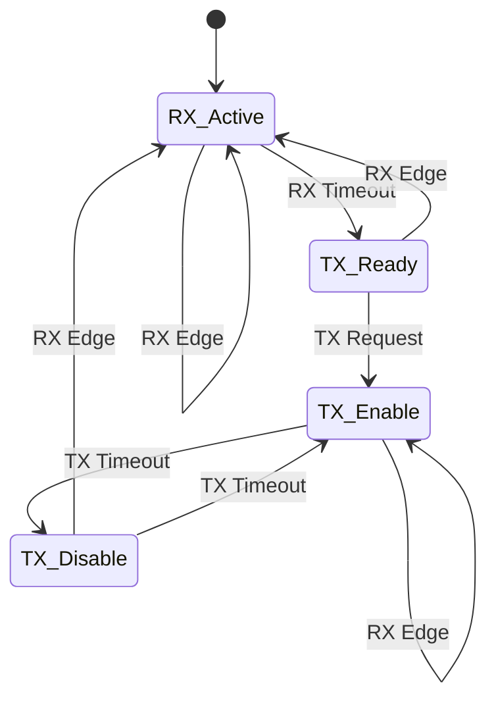

# Tinbus State Diagram

```mermaid
stateDiagram-v2
    [*] --> RX_Active
    RX_Active --> RX_Active: RX Edge
    RX_Active --> TX_Ready: RX Timeout
    TX_Ready --> RX_Active: RX Edge
    TX_Ready --> TX_Enable: TX Request
    TX_Enable --> TX_Disable: TX Timeout
    TX_Enable --> TX_Enable: RX Edge
    TX_Disable --> RX_Active: RX Edge
    TX_Disable --> TX_Enable: TX Timeout

```