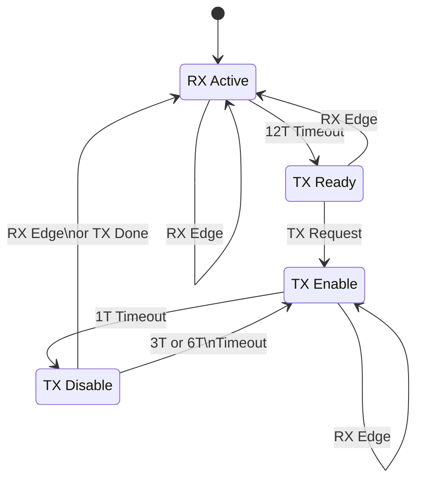

# Tinbus State Diagram

```mermaid
stateDiagram-v2
    RX_Active: RX Active
    TX_Ready: TX Ready
    TX_Enable: TX Enable
    TX_Disable: TX Disable
    [*] --> RX_Active
    RX_Active --> RX_Active: RX Edge
    RX_Active --> TX_Ready: 12T Timeout
    TX_Ready --> RX_Active: RX Edge
    TX_Ready --> TX_Enable: TX Request
    TX_Enable --> TX_Disable: 1T Timeout
    TX_Enable --> TX_Enable: RX Edge
    TX_Disable --> RX_Active: RX Edge\nor TX Done
    TX_Disable --> TX_Enable: 3T or 6T\nTimeout
```